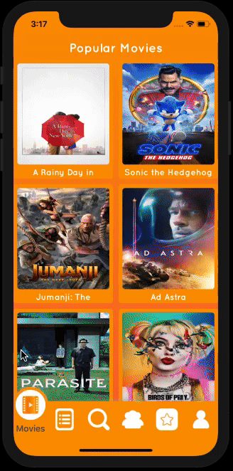
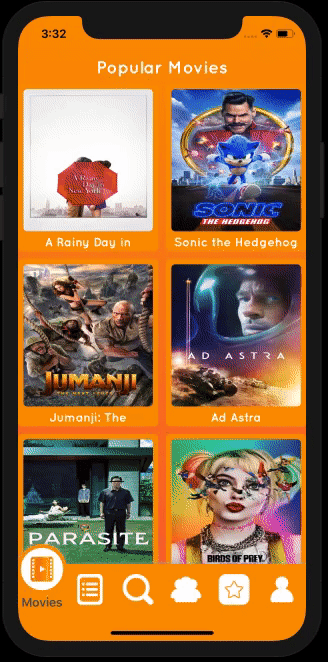

# MoviesApp for ios

MoviesApp for iOS is a real time movies app written in Swift 5.1 using Firebase.

MoviesApp allows to popular movies, category movies, serach movies, actors for movies & favorite movies & actors add list.

<h3 align="center">                 
                      
</h3>

<h3 align="center">                 
                      
</h3> 

<h3 align="center">                 
                      
</h3>                                                                            
                                                                                

## Getting Started

To get started and run the app, you need to follow these simple steps:

1. Open the moviesapp workspace in Xcode.
2. Change the Bundle Identifier to match your domain.
3. Go to [Firebase](https://firebase.google.com) and create new project.
4. Select "Add Firebase to your iOS app" option, type the bundle Identifier & click continue.
5. Download "GoogleService-Info.plist" file and add to the project. Make sure file name is "GoogleService-Info.plist".
6. Go to [Firebase Console](https://console.firebase.google.com), select your project, choose "Authentication" from left menu, select "SIGN-IN METHOD" and enable "Email/Password" option.
7. Open the terminal, navigate to project folder and run "pod update or pod install". 
8. You're all set! Run MoviesApp on your iPhone or the iOS Simulator.

## Compatibility

This project is written in Swift 5.1 and requires Xcode 11.3.1 to build and run.

MoviesApp for iOS is compatible with iOS 13.0+.

## Author

* [Yusuf Sati](https://www.linkedin.com/in/yusuf-sati-09913217b)

## Contact

Copyright 2020 Yusuf Sati.

